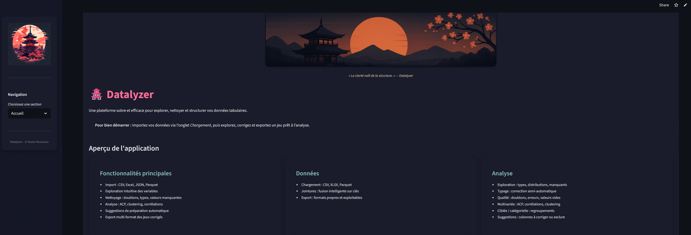
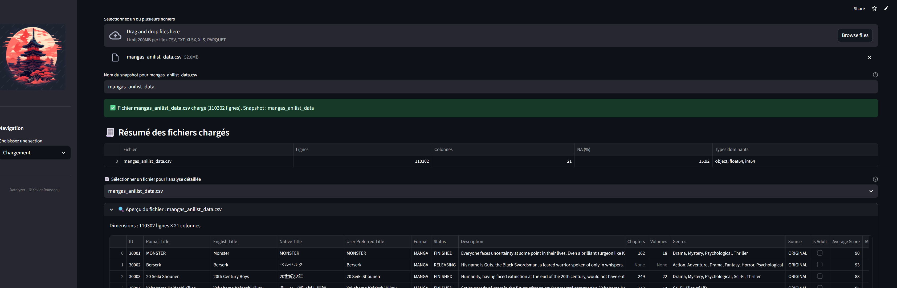
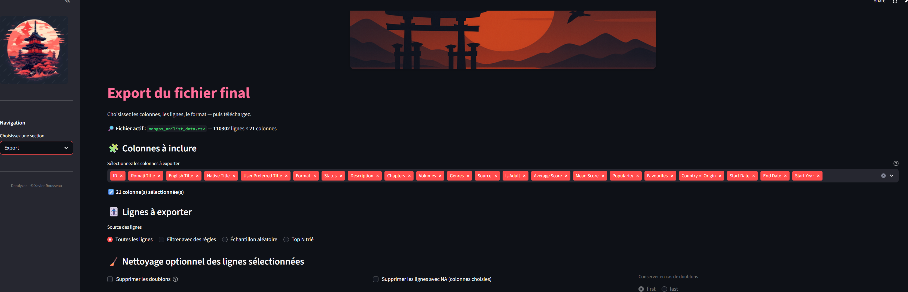

# 🌸 Datalyzer – Analyse exploratoire et nettoyage intelligent de données

Explorez, nettoyez et analysez vos données en toute simplicité. Une application Streamlit pour un EDA plus rapide et plus intelligent.
 
**Datalyzer** est une application interactive construite avec **Streamlit** qui transforme vos données tabulaires (CSV, Excel, Parquet) en une expérience d’exploration fluide, pédagogique et esthétique.
Elle guide chaque étape de l’**analyse exploratoire des données (EDA)** : import, exploration, nettoyage, typage, détection d’anomalies, évaluation de la qualité, analyses multivariées et export final.

Conçue pour les **data analysts, data scientists et ingénieurs data**, Datalyzer associe :

* une **interface intuitive** pour explorer sans coder,
* des **outils robustes** pour fiabiliser les jeux de données,
* des **visualisations interactives** pour comprendre rapidement vos variables et leurs relations.

👉 **Essayez-la en ligne dès maintenant** : [https://datalyzer.streamlit.app/](https://datalyzer.streamlit.app/)

---

## Fonctionnalités principales

* ✅ **Import intelligent** : CSV, TXT, Excel, Parquet (séparateur auto pour CSV/TXT)
* 🧬 **Typage automatique et manuel** : détection de types + correction interactive (int, float, bool, date, cat, texte)
* 🔍 **Exploration guidée** : stats descriptives, valeurs manquantes, distributions, outliers, corrélations
* 🧹 **Nettoyage rapide** : suppression NA, colonnes constantes, faible variance, normalisation
* 🧪 **Qualité des données** : score global sur 100 + drapeaux (NA, doublons, placeholders, constantes)
* 🚨 **Détection d’anomalies** : méthodes robustes (Z-score, IQR, MAD)
* 🎯 **Analyse catégorielle** : matrice de Cramér’s V, crosstabs normalisés, barres empilées, boxplots
* 📊 **Analyse cible** : relations entre une variable cible numérique et le reste du dataset (corrélations, boxplots par catégorie)
* 📈 **Multivariée** : ACP (PCA), clustering K-means, variance expliquée, projections 2D
* 🔗 **Jointures intelligentes** : suggestions de clés, alignement automatique des types, indicateurs de couverture
* 💾 **Export avancé** : sélection colonnes + filtres de lignes (ET/OU, top-N, échantillon, dédup, suppression NA)
* 🕰️ **Snapshots** : sauvegardez l’état intermédiaire de vos données, restaurez ou supprimez-les facilement

---

##Aperçus

* Accueil
  

* Import et aperçu des données
  

* Exploration et corrélations interactives
  

* Score de qualité des données
  

* Export propre et traçabilité
  

---

## Installation et lancement en local

1. Installer les dépendances :

```bash
pip install -r requirements.txt
```

2. Démarrer l’application :

```bash
streamlit run app.py
```

3. Accéder à l’interface depuis votre navigateur :
   [http://localhost:8501](http://localhost:8501)

---

## Organisation du projet

```
datalyzer/
├── app.py                 # Point d’entrée Streamlit
├── config.py              # Paramètres globaux (thème, couleurs, constantes)
│
├── assets/               # Ressources utilisées par l’app (au runtime)
│   └── style_dark.css    # Feuille de style custom injectée dans Streamlit
│
├── sections/              # Pages principales
│   ├── home.py            # Page d’accueil
│   ├── fichiers.py        # Import CSV/TXT/Excel/Parquet + snapshots
│   ├── exploration.py     # Exploration (types, NA, stats, corrélations…)
│   ├── typage.py          # Détection et correction manuelle des types
│   ├── suggestions.py     # Colonnes à encoder / vectoriser / exclure
│   ├── qualite.py         # Score global de qualité des données
│   ├── anomalies.py       # Détection d’anomalies (Z-score, IQR, MAD)
│   ├── cat_analysis.py    # Analyses catégorielles (Cramér’s V, crosstabs…)
│   ├── cible.py           # Analyse d’une variable cible numérique
│   ├── jointures.py       # Fusion et métriques de couverture
│   ├── multivariee.py     # Analyses multivariées (ACP, clustering)
│   └── export.py          # Export colonnes + lignes filtrées
│
├── utils/                 # Fonctions transverses
│   ├── eda_utils.py       # Corrélations, Cramér’s V, boxplots
│   ├── filters.py         # Sélection du dataframe actif + filtres
│   ├── log_utils.py       # Journalisation des actions (CSV)
│   ├── snapshot_utils.py  # Gestion snapshots (sauvegarde atomique)
│   ├── state_manager.py   # Gestion d’état Streamlit
│   └── steps.py           # Séquence canonique des étapes EDA
│
├── data/
│   ├── snapshots/         # Sauvegardes intermédiaires (.csv[.gz])
│   └── exports/           # Données exportées
│
├── logs/
│   └── history_log.csv    # Historique structuré des actions utilisateur
│
├── images/                # Illustrations (headers, icônes)
├── requirements.txt       # Dépendances Python
└── README.md              # Documentation
```

---

## Pourquoi utiliser Datalyzer ?

* Disponible en **ligne** : [datalyzer.streamlit.app](https://datalyzer.streamlit.app/)
* Fonctionne aussi **100 % localement** pour garder vos données confidentielles
* Une **interface claire et pédagogique** qui rend l’EDA accessible sans écrire de code
* Une **traçabilité complète** : snapshots et logs pour rejouer vos étapes
* Un **outil modulaire** pensé pour évoluer (ajout facile de nouveaux blocs analytiques)
* Un design **sobre et zen**, pensé pour travailler efficacement

---

## Cas d’usage concrets

* **Contrôle qualité avant reporting** : vérifier un export CRM/ERP avant intégration BI, détecter doublons ou placeholders.
* **Préparation pour Machine Learning** : corriger les types, encoder les colonnes, nettoyer le bruit avant entraînement d’un modèle.
* **Fusion de fichiers hétérogènes** : joignez plusieurs CSV/Excel et évaluez la qualité de la jointure avec des métriques claires.
* **Audit de données en migration** : calculez un score global de qualité et détectez les anomalies numériques.
* **Exploration pédagogique** : outil idéal pour enseigner l’EDA grâce à une interface guidée et des messages explicatifs.

---

## Auteur

Projet conçu et développé par **Xavier Rousseau**
📊 Data Engineer & Analyst — passionné par la qualité des données, la visualisation et l’automatisation

---
