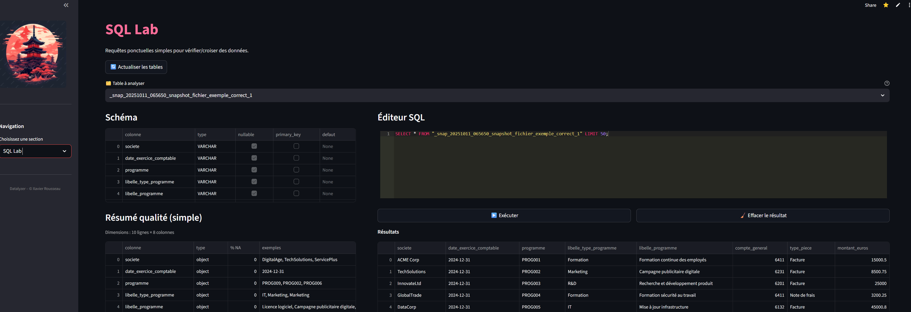

# 🌸 Datalyzer – Analyse exploratoire, nettoyage… et SQL Lab (DuckDB)

Datalyzer est une application interactive Streamlit qui transforme vos données tabulaires (CSV, Excel, Parquet) en une expérience d’exploration fluide, pédagogique et esthétique.
Elle guide chaque étape de l’**analyse exploratoire des données (EDA)** : import, exploration, nettoyage, typage, détection d’anomalies, évaluation de la qualité, analyses multivariées, **exposition SQL** et export final.

Conçue pour les **data analysts, data scientists et ingénieurs data**, Datalyzer associe :

* une **interface intuitive** pour explorer sans coder,
* des **outils robustes** pour fiabiliser les jeux de données,
* des **visualisations interactives** pour comprendre rapidement vos variables et leurs relations,
* un **SQL Lab** (DuckDB en mémoire) pour requêter directement les résultats intermédiaires.

👉 **Essayer en ligne** : [https://datalyzer.streamlit.app/](https://datalyzer.streamlit.app/)

---

## Fonctionnalités principales

* ✅ **Import intelligent** : CSV, TXT, Excel, Parquet (séparateur auto pour CSV/TXT)
* 🧬 **Typage automatique et manuel** : détection + correction (int, float, bool, date, cat, texte)
* 🔍 **Exploration guidée** : stats, manquants, distributions, outliers, corrélations
* 🧹 **Nettoyage rapide** : suppression NA, colonnes constantes, faible variance
* 🧪 **Qualité des données** : score sur 100 + drapeaux (NA, doublons, placeholders)
* 🚨 **Anomalies** : méthodes robustes (Z-score, IQR, MAD)
* 🎯 **Analyse catégorielle** : Cramér’s V, crosstabs normalisés, barres empilées, boxplots
* 📊 **Analyse cible** : corrélations cible num., groupements par catégorie
* 📈 **Multivariée** : ACP (PCA), K-means, variance expliquée, projections 2D/3D
* 🔗 **Jointures intelligentes** : suggestions de clés, alignement des types, couverture
* 💾 **Export avancé** : colonnes + filtres de lignes (ET/OU, top-N, échantillon, dédup, NA)
* 🕰️ **Snapshots** : sauvegarde d’états intermédiaires
* 🧩 **SQL Lab (DuckDB)** : exécute des **SELECT** sur les tables exposées depuis n’importe quelle section

---

## SQL Lab (DuckDB) — c’est quoi ?

Un **moteur SQL en mémoire** pour requêter instantanément les sorties des différentes sections (typage, anomalies, PCA, agrégats…).
Techniquement :

* **DuckDB** tourne en mémoire et gère des vues/tab. à partir de `pandas`, `polars` ou `pyarrow`.

* Un petit pont `utils/sql_bridge.py` te permet d’**exposer** n’importe quel DataFrame au SQL Lab via :

  ```python
  from utils.sql_bridge import expose_to_sql_lab

  expose_to_sql_lab("nom_table", df, make_active=True)
  ```

  * `nom_table` est nettoyé (`-` et espaces → `_`).
  * `make_active=True` (optionnel) marque cette table comme **active** (utile pour autocomplétion côté UI).

* Le module `utils/sql_lab.py` fournit :

  * une **connexion DuckDB** persistante en session,
  * l’**enregistrement** (ou ré-enregistrement) des tables exposées,
  * une exécution **sécurisée** des requêtes (seuls les `SELECT` sont autorisés),
  * l’**introspection** (liste des tables, `DESCRIBE` friendly).

### Sécurité (garde-fous)

Le SQL Lab **refuse** DDL/DML (ex. `DROP`, `UPDATE`, `CREATE`, `ALTER`, `ATTACH`…), seules les requêtes **SELECT** sont exécutées.
Les tables exposées sont ré-enregistrées comme **vues DuckDB** à chaque mise à jour.

### Bonnes pratiques de nommage

Pour garder une cartographie claire, Datalyzer nomme souvent les tables exposées ainsi :

* `nom_fichier__missing_dropped` — après nettoyage NA
* `nom_fichier__outliers_iqr_<col>` — outliers détectés
* `nom_fichier__auto_cleaned` — nettoyage auto
* `nom_fichier__pca_scores_<k>[_std]` — scores PCA
* `nom_gauche_nom_droite` — jointure
* `nom_fichier__export_selection` — sélection exportée, etc.

---

## Aperçus

* Accueil
  

* Import et aperçu des données
  

* Exploration et corrélations interactives
  

* Score de qualité des données
  

* Export propre et traçabilité
  

* SQL Lab — requête sur résultats intermédiaires
  

---

## Installation et lancement en local

1. Dépendances :

```bash
pip install -r requirements.txt
```

2. Lancer l’application :

```bash
streamlit run app.py
```

3. Ouvrir dans le navigateur :
   [http://localhost:8501](http://localhost:8501)

---

## Utiliser le SQL Lab dans vos sections

Dans **toute section** où vous produisez un DataFrame exploitable, exposez-le :

```python
from utils.sql_bridge import expose_to_sql_lab

# Exemple : après typage
expose_to_sql_lab("df_typed", df, make_active=True)

# Exemple : scores PCA (avec index pour jointures faciles)
scores_sql = scores.copy()
scores_sql.insert(0, "__index__", scores_sql.index)
expose_to_sql_lab(f"{nom_fichier}__pca_scores_{n_comp}", scores_sql)
```

Ensuite, dans l’onglet **SQL Lab**, requêtez librement :

```sql
-- Exemples
SELECT * FROM df_typed LIMIT 50;

SELECT s.__index__, s.PC1, s.PC2, d.cible
FROM myfile__pca_scores_3 AS s
LEFT JOIN df_typed AS d ON d.index = s.__index__;
```

> ℹ️ L’interface SQL Lab liste les tables disponibles et autorise **uniquement des SELECT**.

---

## Organisation du projet

```
datalyzer/
├── app.py                 # Point d’entrée Streamlit
├── config.py              # Paramètres globaux (thème, couleurs, constantes)
│
├── assets/               # Ressources utilisées par l’app (au runtime)
│   └── style_dark.css    # Feuille de style custom injectée dans Streamlit
│
├── sections/              # Pages principales
│   ├── home.py            # Page d’accueil
│   ├── fichiers.py        # Import CSV/TXT/Excel/Parquet + snapshots
│   ├── exploration.py     # Exploration (types, NA, stats, corrélations…)
│   ├── typage.py          # Détection et correction manuelle des types
│   ├── suggestions.py     # Colonnes à encoder / vectoriser / exclure
│   ├── qualite.py         # Score global de qualité des données
│   ├── anomalies.py       # Détection d’anomalies (Z-score, IQR, MAD)
│   ├── cat_analysis.py    # Analyses catégorielles (Cramér’s V, crosstabs…)
│   ├── cible.py           # Analyse d’une variable cible numérique
│   ├── jointures.py       # Fusion et métriques de couverture
│   ├── multivariee.py     # Analyses multivariées (ACP, clustering)
│   ├──  export.py         # Export colonnes + lignes filtrées
│   └── sql_lab.py         # interface SQL Lab
│
├── utils/                 # Fonctions transverses
│   ├── eda_utils.py       # Corrélations, Cramér’s V, boxplots
│   ├── filters.py         # Sélection du dataframe actif + filtres
│   ├── log_utils.py       # Journalisation des actions (CSV)
│   ├── snapshot_utils.py  # Gestion snapshots (sauvegarde atomique)
│   ├── state_manager.py   # Gestion d’état Streamlit
│   ├── steps.py           # Séquence canonique des étapes EDA
│   ├── sql_lab.py         # Connexion DuckDB, enregistrement, exécution sécurisée
│   └── sql_bridge.py      # Helper "expose_to_sql_lab(name, df, make_active=False)"
│
├── data/
│   ├── snapshots/         # Sauvegardes intermédiaires (.csv[.gz])
│   └── exports/           # Données exportées
│
├── logs/
│   └── history_log.csv    # Historique structuré des actions utilisateur
│
├── images/                # Illustrations (headers, icônes)
├── requirements.txt       # Dépendances Python
└── README.md              # Documentation
```
---

## Pourquoi utiliser Datalyzer ?

* Disponible en **ligne** : [datalyzer.streamlit.app](https://datalyzer.streamlit.app/)
* Fonctionne aussi **100 % localement**
* UI **claire et pédagogique**
* **Traçabilité** : snapshots + logs
* **Modulaire** : facile d’ajouter de nouveaux blocs analytiques
* Désormais : **requêtes SQL instantanées** sur vos résultats intermédiaires

---

## Cas d’usage concrets

* **Contrôle qualité avant reporting** : vérifier un export CRM/ERP, détecter doublons/placeholders, requêter les résultats par SQL.
* **Préparation ML** : corriger les types, encoder, nettoyer → exposer les tables d’entraînement/validation au SQL Lab.
* **Fusion de fichiers** : joignez plusieurs CSV/Excel, mesurez la couverture, **inspectez la fusion** en SQL.
* **Audit de migration** : score de qualité + anomalies + requêtes ciblées.
* **Exploration pédagogique** : interface guidée + SQL pour illustrer les jointures/agrégats.

---

## Auteur

Projet conçu et développé par **Xavier Rousseau**
📊 Data Analyst — passionné par la qualité des données, la visualisation et l’automatisation

---
